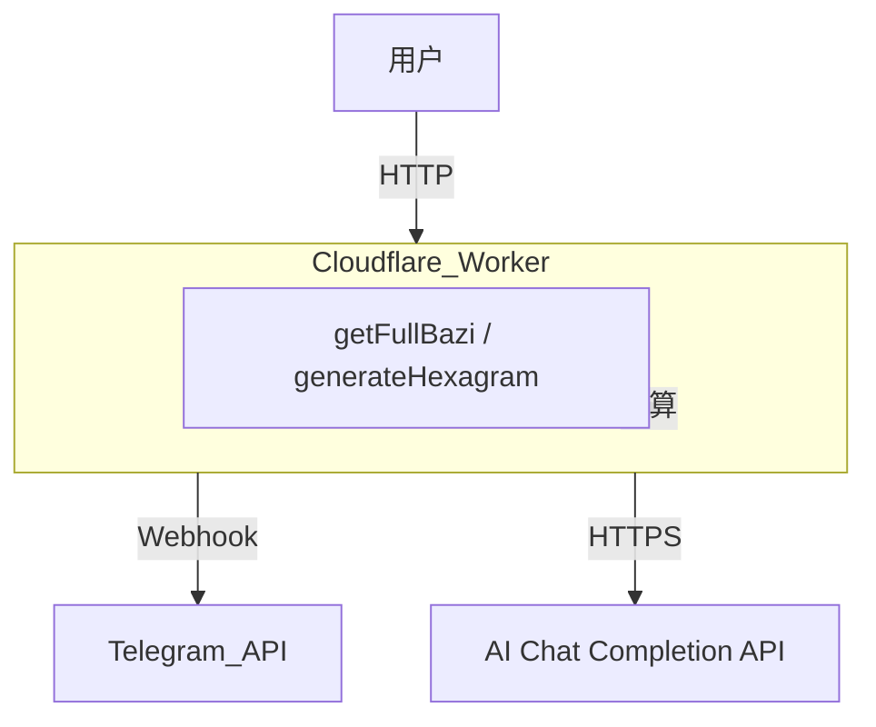

# Telegram 占卜机器人

> 基于 **Cloudflare Workers** 与 **Telegram Bot API** 构建的无服务器（Serverless）占卜机器人，结合 **小六壬** 传统算法与 **AI 大语言模型** 。

## 项目亮点

| 功能               | 说明                                                                                 |
| ------------------ | ------------------------------------------------------------------------------------ |
| 🔮 小六壬占卜      | 基于干支四柱随机生成卦象，并结合 AI 提供专业解读                                         |
| 🤖 AI 智能分析     | 兼容 OpenAI / OpenRouter 等 Chat Completion 接口，支持多模型切换                         |
| 🛡️ 白名单控制      | 内置用户白名单 / 群组白名单，轻松实现权限管理                                           |
| 💬 命令交互        | 支持 `/sm`（占卜）、`/id`（查询 ID）等指令，避免群聊刷屏                                |
| 🔗 消息引用        | 群聊中可引用他人消息后发送 `/sm`，直接对引用内容进行解析                                |
| ⚡ Serverless 架构  | 基于 Cloudflare Workers，零服务器运维成本，自动弹性伸缩                                 |

---

## 架构概览



---

## 快速开始

### 1. 前置条件

* Node.js ≥ 18
* npm ≥ 9
* 安装 [`wrangler`](https://developers.cloudflare.com/workers/wrangler/)：

```bash
npm i -g wrangler
```

### 2. 克隆项目

```bash
git clone https://github.com/your-username/telegram-worker-bot.git
cd telegram-worker-bot
npm install
```

### 3. 配置环境变量

本项目 **必须** 配置以下 4 个核心环境变量，另有 2 个白名单可选：

| 变量名                 | 必需 | 示例值                                               | 说明                                   |
| ---------------------- | ---- | ---------------------------------------------------- | -------------------------------------- |
| `ENV_BOT_TOKEN`        | ✅   | `123456:ABC-DEF1234ghIkl-zyx57W2v1u123er1`           | BotFather 生成的 Bot Token            |
| `ENV_BOT_SECRET`       | ✅   | `your-super-secret-token-123`                        | 自定义，用于校验 Telegram Webhook      |
| `ENV_AI_API_ENDPOINT`  | ✅   | `https://openrouter.ai/api/v1/chat/completions`      | AI 聊天接口地址                        |
| `ENV_AI_API_KEY`       | ✅   | `sk-xxxxxxxxxxxxxxxxxxxxxxxxxxxxxxxxxxxx`           | AI Key                                 |
| `ENV_USER_WHITELIST`   | ⬜   | `123456,789012`                                     | 用户白名单，多 ID 逗号分隔             |
| `ENV_GROUP_WHITELIST`  | ⬜   | `-1001234567,-1009876543`                            | 群组白名单（群组 ID 为负数）           |

使用 `wrangler secret put <ENV_NAME>` 将变量写入 Cloudflare Worker：

```bash
wrangler secret put ENV_BOT_TOKEN
wrangler secret put ENV_BOT_SECRET
wrangler secret put ENV_AI_API_ENDPOINT
wrangler secret put ENV_AI_API_KEY

# 可选白名单
wrangler secret put ENV_USER_WHITELIST
wrangler secret put ENV_GROUP_WHITELIST
```

### 4. 本地预览（可选）

```bash
wrangler dev --inspect --local
```

---

## 本地开发

1. **代码风格**：项目使用 **ESLint + Prettier**（未集成请按需配置）。
2. **注释规范**：全部采用 **Doxygen + 中文注释**，便于企业级代码审计。
3. **单元测试**：使用 [Vitest](https://vitest.dev/)（见下文测试章节）。

修改代码后，通过下列命令运行测试：

```bash
npm run test
```

---

## 部署到 Cloudflare

```bash
# 首次部署
npx wrangler deploy

# 更新部署
npx wrangler deploy --minify
```

部署成功后，`wrangler` 会输出类似：

```
✨  Built successfully, built project size is 23 KiB.
✨  Successfully published your script to:
  https://my-bot.your-username.workers.dev
```

将此 URL 记为 `YOUR_WORKER_URL`，后续注册 Webhook 使用。

---

## Webhook 注册 / 取消

注册 Webhook（自动调用 `setWebhook`）：

```
https://YOUR_WORKER_URL/registerWebhook
```

取消 Webhook：

```
https://YOUR_WORKER_URL/unRegisterWebhook
```

---

## 测试

```bash
# 运行所有测试（Vitest）
npm run test
```

测试覆盖：

* 干支四柱计算 `src/utils/ganzhi.js`
* 卦象随机生成 `src/utils/hexagram.js`
* 消息处理流程 `src/index.js`

---

## 常见问题

<details>
<summary>Bot 没有响应 /sm 命令？</summary>
1. 确认已正确设置 Webhook。
2. 检查 `ENV_BOT_SECRET` 是否与注册时一致。
3. 确认用户 / 群组在白名单内（或未配置白名单）。
</details>

<details>
<summary>AI 接口报错或超时？</summary>
1. 检查 `ENV_AI_API_ENDPOINT` 是否可访问。
2. 关注调用额度 / 余额。
3. 考虑降低并发或更换模型。
</details>

---

## 项目结构

```text
telegram-worker-bot/
├── src/                # 业务源码
│   ├── index.js        # 主入口（Worker）
│   └── utils/          # 占卜工具函数
│       ├── ganzhi.js   # 干支四柱相关
│       └── hexagram.js # 卦象生成
├── test/               # 单元测试
├── vitest.config.js    # 测试配置
├── wrangler.jsonc      # Cloudflare Workers 配置
└── README.md           # 项目说明
```

---

## 贡献指南

欢迎大家提交 **Issue** 与 **PR**！在开始贡献之前，请确保：

1. Fork 仓库并创建分支：`git checkout -b feature/your-feature`。
2. 遵循代码注释与格式规范，保证单元测试通过。
3. 提交前运行 `npm run test` 与静态检查。
4. 在 PR 描述中清晰说明变更动机与实现细节。

---

## License

[MIT](LICENSE)

---

## 致谢

* [Cloudflare Workers](https://workers.cloudflare.com/)
* [Telegram Bot API](https://core.telegram.org/bots/api)
* [OpenRouter](https://openrouter.ai/) / OpenAI

> 如果本项目对你有所帮助，欢迎 ⭐Star 支持！
